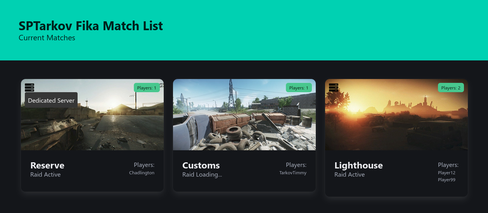

# SPTarkov Fika Raid Info

This project is a web interface to display current SPTarkov Fika raids. It uses PHP and composer to handle its dependencies. The site provides a visual representation of various raids and their data, sourced from the server.



## Installation

To get this project up and running, follow these steps:

### 1. Clone the Repository

```bash
git clone https://github.com/Rambomst/sptarkov-fika-raid-info-viewer
cd sptarkov-fika-raid-info-viewer
```

### 2. Install Dependencies

The project uses `composer` for managing PHP dependencies. Ensure you have [Composer](https://getcomposer.org/) installed.

```bash
composer install
```

### 3. Configure the Project

Create a `config.json` using the `config.example.json` file as a template with the correct values before deploying the project.

```json
{
    "ui": {
        "title": "SPTarkov Fika Match List"
    },
    "tarkov": {
        "host": "1.1.1.1",
        "port": "6969",
        "dedicated_clients": [
            "XXXXX"
        ]
    }
}
```

#### Configurable Options:

- **ui.title**: Set the title of the web interface (e.g., "SPTarkov Fika Match List").
- **tarkov.host**: The host IP for the Fika server.
- **tarkov.port**: The port used by the server.
- **tarkov.dedicated_clients**: A list of dedicated client IDs which will be excluded from the player list and counts.

You need to replace the `XXXXX` in `dedicated_clients` with actual client IDs for your environment.

### 4. Run the Application

Once the configuration is complete, the application is ready to run on your web server.

You can use any PHP server or setup an Apache/Nginx environment to serve the files.

## Updating Dependencies

To update the composer dependencies, run:

```bash
composer update
```

This will fetch and install the latest versions of the dependencies defined in the `composer.json` file.

## Contributing

Feel free to fork this repository and submit pull requests. Any help to improve this project is welcome.
